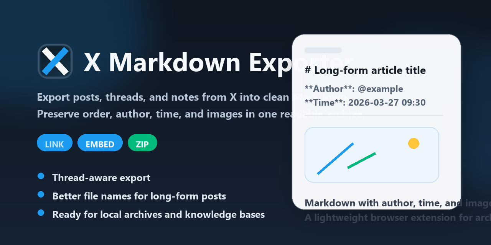

# X Markdown Exporter



[中文](#chinese) | [English](#english)

一个用于导出 X（Twitter）推文、线程和长文为 Markdown 的 Chrome 扩展。

X Markdown Exporter is a Chrome extension for exporting X (Twitter) posts, threads, and long-form notes into Markdown.

<a id="chinese"></a>

## 中文

### 这是什么

它会尽量保留原页面里的图文顺序，并支持三种下载方式：链接引用、内嵌图片、ZIP 打包。导出默认附带作者和发布时间，适合做归档、收藏、整理素材和后续二次写作。

### 功能特性

- 支持 X / Twitter 推文详情页导出
- 支持长文 / Note 页面提取
- 自动保留正文与图片的原始顺序
- 支持同作者线程连续导出
- 支持三种导出模式：
  - `link`：Markdown 中保留远程图片链接
  - `embed`：图片压缩后转为 Base64 内嵌到单个 Markdown 文件
  - `zip`：Markdown 和图片一起打包为 ZIP
- 默认附带作者与发布时间
- 自动优化标题与文件名，跳过开头图片占位内容
- 所有处理都在本地浏览器完成，不依赖后端服务

### 安装方式

#### 方式一：从 GitHub Release 下载

1. 打开 [Releases](https://github.com/Renn9527/x-markdown-exporter/releases)
2. 下载最新版本里的 `x-markdown-exporter-v1.3.0.zip`
3. 解压 ZIP 文件
4. 打开 Chrome / Edge 扩展管理页：
   - Chrome: `chrome://extensions/`
   - Edge: `edge://extensions/`
5. 开启“开发者模式”
6. 点击“加载已解压的扩展程序”
7. 选择解压后的目录

#### 方式二：直接克隆仓库

```bash
git clone https://github.com/Renn9527/x-markdown-exporter.git
```

然后同样在扩展管理页中加载仓库目录。

### 使用方法

1. 打开一条 X 推文详情页，或一篇 X 长文页面
2. 点击浏览器工具栏中的扩展图标
3. 选择下载模式
4. 点击“下载 Markdown”

### 导出模式说明

#### `link`

Markdown 中的图片使用原始 URL。

适合：
- 文件尽量小
- 不需要离线查看图片

#### `embed`

图片会压缩后以内嵌方式写入 Markdown。

适合：
- 希望保留单文件
- 方便直接导入 Obsidian、Notion 或本地知识库

#### `zip`

Markdown 和图片分开保存，再一起打包成 ZIP。

适合：
- 完整离线归档
- 希望 Markdown 本体保持清爽

### 项目结构

```text
.
├─ manifest.json
├─ popup.html
├─ popup.js
├─ content.js
├─ background.js
├─ jszip.min.js
├─ content.css
├─ icons/
└─ assets/
```

### 技术实现

- `content.js`
  - 识别推文详情页和长文页面
  - 提取正文、图片、作者、时间和线程内容
  - 生成最终 Markdown
- `background.js`
  - 负责跨域抓取图片
  - 将图片转成 Base64，供内嵌或 ZIP 模式使用
- `popup.js`
  - 检测当前页面是否可导出
  - 切换导出模式并触发下载

### 已知限制

- 需要在推文详情页或长文页面使用，列表流页面不会直接导出
- X 页面 DOM 结构如果发生明显变化，提取规则可能需要更新
- 当前主要覆盖文字、图片和线程内容，复杂卡片内容可能存在提取差异

### 隐私说明

- 不上传内容到第三方服务器
- 不依赖账号登录之外的外部服务
- 图片资源仅通过扩展后台从 X / Twitter 官方资源地址拉取

### 开发说明

项目目前是纯前端浏览器扩展，无构建步骤。

如需本地修改：

1. 编辑项目文件
2. 回到扩展管理页
3. 点击“重新加载”
4. 在 X 页面重新测试

<a id="english"></a>

## English

### What It Does

X Markdown Exporter preserves the reading order of text and images on X pages and lets you export content in three formats: linked images, embedded images, or a ZIP archive. Author and publish time are included by default, which makes it useful for archiving, collecting references, and reusing content in writing workflows.

### Features

- Export X / Twitter post detail pages to Markdown
- Extract content from long-form notes and article pages
- Preserve the original order of text and images
- Export same-author thread continuations
- Support three output modes:
  - `link`: keep remote image URLs inside Markdown
  - `embed`: compress images and embed them as Base64 in a single Markdown file
  - `zip`: package Markdown and images together in a ZIP archive
- Include author and publish time by default
- Generate cleaner titles and filenames by skipping leading image placeholders
- Run fully in the browser without any backend service

### Installation

#### Option 1: Download from GitHub Releases

1. Open [Releases](https://github.com/Renn9527/x-markdown-exporter/releases)
2. Download `x-markdown-exporter-v1.3.0.zip`
3. Extract the ZIP file
4. Open the extensions page in Chrome or Edge:
   - Chrome: `chrome://extensions/`
   - Edge: `edge://extensions/`
5. Enable Developer Mode
6. Click `Load unpacked`
7. Select the extracted folder

#### Option 2: Clone the Repository

```bash
git clone https://github.com/Renn9527/x-markdown-exporter.git
```

Then load the repository folder as an unpacked extension.

### Usage

1. Open an X post detail page or a long-form note page
2. Click the extension icon in the browser toolbar
3. Choose an export mode
4. Click `Download Markdown`

### Export Modes

#### `link`

Images remain as remote URLs inside the Markdown file.

Best for:
- the smallest possible file size
- online reading with no offline image requirement

#### `embed`

Images are compressed and embedded directly into the Markdown file.

Best for:
- a single self-contained file
- importing into Obsidian, Notion, or local knowledge bases

#### `zip`

Markdown and images are stored separately and packaged into a ZIP file.

Best for:
- complete offline archiving
- keeping the Markdown body cleaner

### Project Structure

```text
.
├─ manifest.json
├─ popup.html
├─ popup.js
├─ content.js
├─ background.js
├─ jszip.min.js
├─ content.css
├─ icons/
└─ assets/
```

### Technical Notes

- `content.js`
  - detects post detail pages and note pages
  - extracts text, images, author, time, and thread content
  - builds the final Markdown output
- `background.js`
  - fetches cross-origin images
  - converts images to Base64 for `embed` and `zip` modes
- `popup.js`
  - checks whether the current page can be exported
  - switches export modes and triggers downloads

### Known Limitations

- The extension is meant for post detail pages and note pages, not the timeline feed itself
- If X changes its DOM structure significantly, extraction rules may need updates
- The current extractor focuses on text, images, and thread content; complex cards may vary

### Privacy

- No content is uploaded to third-party servers
- No external service is required beyond normal X browsing
- Images are fetched only from official X / Twitter asset URLs through the extension background worker

### Development

This project is a plain browser extension with no build step.

To test local changes:

1. Edit the project files
2. Return to the browser extensions page
3. Click `Reload`
4. Test again on an X page

## License

[MIT](LICENSE)
