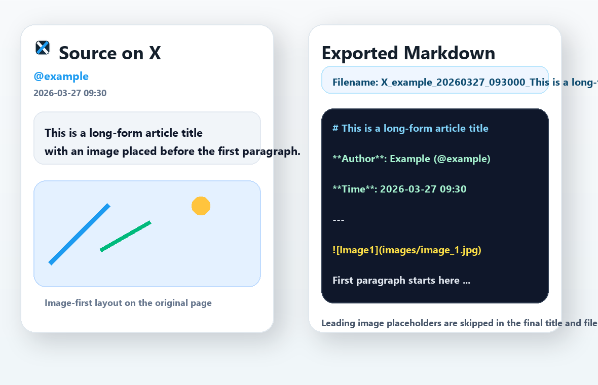

# X Markdown Exporter


[中文](#chinese) | [English](#english)

X Markdown Exporter is a Chrome / Edge extension for exporting X (Twitter) posts, threads, and long-form notes into Markdown.

## Latest Update

### v1.5.0

- Detect empty DOM extractions and show actionable failure messages with a GitHub issue link
- Add `source_url` metadata to every export
- Warn before oversized `embed` exports and offer an automatic fallback to ZIP
- Reuse already-processed images when `embed` switches to ZIP packaging

## Preview

### Export Example



<a id="chinese"></a>

## 中文

### 这是什么

这是一个把 X / Twitter 推文、线程和 Note 导出成 Markdown 的浏览器扩展。新版默认在页面右侧提供可拖动的悬浮按钮，点开后即可选择导出模式，不需要把插件固定在工具栏里。

### 亮点

- 支持 X / Twitter 推文详情页和 Note 页面导出
- 页面内右侧悬浮按钮，支持横向和纵向拖动，自动记住位置
- 点击后弹出小面板，直接选择导出模式
- 保留正文和图片的原始顺序
- 支持同作者线程连续导出
- 支持外链预览卡提取，导出时会尽量保留链接标题、摘要和域名
- 支持三种导出模式
- 默认附带作者和发布时间
- 所有处理都在本地浏览器完成，不依赖后端服务

### 导出模式

#### `link`

Markdown 中保留远程图片地址，并尽量把链接卡片转成普通 Markdown 链接。

适合：

- 文件体积最小
- 在线阅读或二次整理

#### `embed`

图片压缩后以内嵌 Base64 的形式写入单个 Markdown 文件。

适合：

- 想保留单文件
- 导入 Obsidian、Notion 或本地知识库

#### `zip`

Markdown 和图片分开保存，再打包成 ZIP。

适合：

- 完整离线归档
- 希望 Markdown 正文更清爽

### 安装

#### 方式一：从 GitHub Releases 下载

1. 打开 [Releases](https://github.com/Renn9527/x-markdown-exporter/releases)
2. 下载最新版本里的 `x-markdown-exporter-v1.5.0.zip`
3. 解压 ZIP 文件
4. 打开扩展管理页
   Chrome: `chrome://extensions/`
   Edge: `edge://extensions/`
5. 开启“开发者模式”
6. 点击“加载已解压的扩展程序”
7. 选择解压后的目录

#### 方式二：直接克隆仓库

```bash
git clone https://github.com/Renn9527/x-markdown-exporter.git
```

然后同样在浏览器扩展管理页加载仓库目录。

### 使用方法

1. 打开一条 X 推文详情页或一篇 X Note 页面
2. 在页面右侧找到悬浮按钮
3. 如果挡住内容，可以直接拖到更合适的位置
4. 点开面板后选择导出模式
5. 点击 `下载 Markdown`

工具栏里的扩展弹窗仍然保留，作为备用入口。

### 项目结构

```text
.
├─ manifest.json
├─ popup.html
├─ popup.js
├─ content.js
├─ content-core.js
├─ content-export.js
├─ content-ui.js
├─ content.css
├─ background.js
├─ jszip.min.js
├─ icons/
├─ assets/
└─ dist/
```

### 技术说明

- `content.js`
  - 作为内容脚本入口
  - 负责消息监听、导出编排和模块初始化
- `content-core.js`
  - 处理正文、图片、线程、引用推文和链接卡片提取
  - 负责标题和文件名生成
- `content-export.js`
  - 负责 Markdown 组装、图片压缩和三种下载模式
- `content-ui.js`
  - 负责悬浮按钮、面板、拖动交互和页面状态管理
- `content.css`
  - 定义悬浮按钮、弹层和提示样式
- `background.js`
  - 负责跨域抓取图片
  - 为 `embed` 和 `zip` 模式提供 Base64 数据
- `popup.js`
  - 保留工具栏备用入口

### 已知限制

- 主要面向推文详情页和 Note 页面，时间线首页不会直接导出
- 如果 X 调整 DOM 结构，提取规则可能需要跟进
- 大多数外链预览卡可以提取，但极个别复杂卡片仍可能不完整

### 隐私说明

- 不上传内容到第三方服务器
- 不依赖除 X / Twitter 资源之外的外部服务
- 图片仅通过扩展后台从官方资源地址获取

### 本地开发

项目没有构建步骤。

本地测试：

1. 修改仓库文件
2. 打开浏览器扩展管理页
3. 点击“重新加载”
4. 回到 X 页面刷新并测试

<a id="english"></a>

## English

### What It Does

X Markdown Exporter exports X / Twitter posts, threads, and long-form notes into Markdown. The latest UI uses a draggable floating button on the right side of the page, so you can open the export panel directly inside X without pinning the extension in the browser toolbar.

### Highlights

- Export X / Twitter post detail pages and Note pages
- Draggable in-page floating launcher with saved position
- Open a compact export panel directly on the page
- Preserve the original order of text and images
- Export same-author thread continuations
- Convert supported link preview cards into Markdown links with title / summary / domain
- Support `link`, `embed`, and `zip` output modes
- Include author, publish time, and `source_url` by default
- Guard oversized `embed` exports by offering a ZIP fallback
- Run fully in the browser with no backend service

### Export Modes

#### `link`

Keep remote image URLs in Markdown and preserve supported external preview cards as Markdown links.

Best for:

- the smallest file size
- online reading or lightweight notes

#### `embed`

Compress images and embed them as Base64 in a single Markdown file. Oversized exports warn first and can fall back to ZIP automatically.

Best for:

- a single self-contained file
- importing into Obsidian, Notion, or local knowledge bases

#### `zip`

Store Markdown and images separately, then package them into a ZIP archive.

Best for:

- full offline archiving
- keeping the Markdown body cleaner

### Installation

#### Option 1: Download from GitHub Releases

1. Open [Releases](https://github.com/Renn9527/x-markdown-exporter/releases)
2. Download `x-markdown-exporter-v1.5.0.zip`
3. Extract the ZIP file
4. Open the extensions page
   Chrome: `chrome://extensions/`
   Edge: `edge://extensions/`
5. Enable Developer Mode
6. Click `Load unpacked`
7. Select the extracted folder

#### Option 2: Clone the Repository

```bash
git clone https://github.com/Renn9527/x-markdown-exporter.git
```

Then load the repository folder as an unpacked extension.

### Usage

1. Open an X post detail page or a Note page
2. Find the floating launcher on the right side
3. Drag it away if it overlaps the content
4. Open the panel and choose an export mode
5. Click `Download Markdown`

The toolbar popup is still available as a fallback entry point.

### Project Structure

```text
.
├─ manifest.json
├─ popup.html
├─ popup.js
├─ content.js
├─ content-core.js
├─ content-export.js
├─ content-ui.js
├─ content.css
├─ background.js
├─ jszip.min.js
├─ icons/
├─ assets/
└─ dist/
```

### Technical Notes

- `content.js`
  - acts as the content-script entry point
  - wires message handling, export orchestration, and module bootstrap
- `content-core.js`
  - extracts text, images, same-author threads, quoted tweets, and supported link preview cards
  - generates titles and filenames
- `content-export.js`
  - assembles Markdown, compresses images, and handles all download modes
- `content-ui.js`
  - manages the floating launcher, panel UI, dragging, and page readiness state
- `content.css`
  - styles the floating launcher, panel, and toasts
- `background.js`
  - fetches cross-origin images
  - provides Base64 payloads for `embed` and `zip`
- `popup.js`
  - keeps the toolbar popup as a fallback

### Known Limitations

- The extension is designed for post detail pages and Note pages, not the main timeline feed
- If X changes its DOM structure significantly, the extraction rules may need updates, but empty exports now fail with a clearer warning instead of silently saving a blank file
- Most preview cards are handled, but a few complex cards may still be incomplete

### Privacy

- No content is uploaded to third-party servers
- No external backend service is required
- Images are fetched only from official X / Twitter asset URLs through the extension background worker

### Development

There is no build step.

To test local changes:

1. Edit the repository files
2. Open the browser extensions page
3. Click `Reload`
4. Refresh an X page and test again

## License

[MIT](LICENSE)
